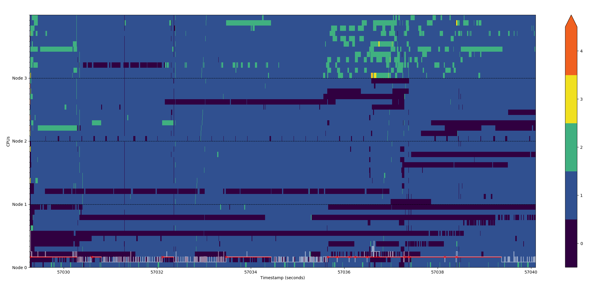

# plot-nr-running
Create heat map and find imbalances from recorded *sched\_update\_nr\_running* events with *trace-cmd*.

This script reads output of `trace-cmd report` command with `sched_update_nr_running` events. From this data it plots heat map showing number of active tasks on each core of processor with line graph showing imbalance between the numbers.

## Usage
Check support of the `sched_update_nr_running` event in the installed kernel:
```bash
trace-cmd list | grep sched_update_nr_running
```

Generate trace report with `sched_update_nr_running` events:
```bash
trace-cmd record -e sched:sched_update_nr_running  # append a command to trace or terminate with Ctrl+C
trace-cmd report > trace_report.trace
```

Create heat map with `plot-nr-running.py`:
```bash
./plot-nr-running.py trace_report.trace
```

### Arguments
The report file can be specified as positional argument, or passed through `stdin`:
```bash
./plot-nr-running.py trace_report.trace
trace-cmd report | ./plot-nr-running.py
```
Other optional arguments can be viewed using `--help` arguments:
```
  --sampling SAMPLING   Sampling of plotted data to reduce drawing point_time
  --threshold THRESHOLD
                        Minimal difference of process count considered as
                        imbalance
  --duration DURATION   Minimal duration of imbalance worth reporting
  --image-file IMAGE_FILE
                        Save plotted heatmap to file instead of showing
  --lscpu-file LSCPU_FILE
                        File with output of lscpu from observed machine
```

## Example
```bash
./plot-nr-running.py example/example.trace --lscpu-file example/example-lscpu.txt
```

