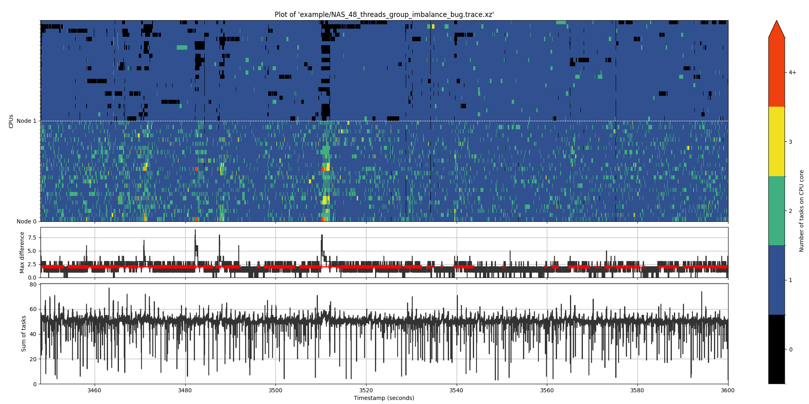

# plot-nr-running
Create heat map and find imbalances from recorded *sched\_update\_nr\_running* events with *trace-cmd*.

This script reads output of `trace-cmd report` command with `sched_update_nr_running` events. From this data it plots heat map showing number of active tasks on each core of processor with line graph showing imbalance between the numbers.

## Usage
Check support of the `sched_update_nr_running` event in the installed kernel:
```bash
trace-cmd list | grep sched_update_nr_running
```

Generate trace report with `sched_update_nr_running` events:
```bash
trace-cmd record -e sched:sched_update_nr_running  # append a command to trace or terminate with Ctrl+C
trace-cmd report > trace_report.trace
```

Create heat map with `plot-nr-running.py`:
```bash
./plot-nr-running.py trace_report.trace
```

### Arguments
The report file can be specified as positional argument, or passed through `stdin`:
```bash
./plot-nr-running.py trace_report.trace
trace-cmd report | ./plot-nr-running.py
```
Other optional arguments can be viewed using `--help` arguments:
```
  --sampling SAMPLING   Sampling of plotted data to reduce drawing time -
                        takes each N-th event. Is applied before time
                        sampling. Imbalances are always searched on all
                        events.
  --time-sampling TIME_SAMPLING
                        Reduce plotted data to N records per second to shorten
                        drawing time. Is applied after input sampling.
  --threshold THRESHOLD
                        Minimal difference of process count considered as
                        imbalance
  --duration DURATION   Minimal duration of imbalance worth reporting
  --image-file IMAGE_FILE
                        Save plotted heatmap to this file. Defaults to
                        INPUT_FILE.png, the heatmap is shown in a window when
                        reading from stdin.
  --lscpu-file LSCPU_FILE
                        File with output of lscpu from observed machine
  --name NAME           Filename to be displayed in graph. Usefull when
                        reading input from stdin.
  --title TITLE         Title of the graph. Overrides --name.
```

Imbalance is a period when the difference between the most and the least
loaded CPU is at least `--threshold` tasks for at least `--duration` seconds.
CPUs without any event in the trace are considered idle.

Some older kernels record the `change` field of the event unsigned. The
scripts detect it and print a note, as the number of tasks before the first
event of each CPU cannot be determined exactly in that case.

## Other scripts
* `check-nr-running.py` reports per-CPU and per-NUMA-node utilization and
  checks the trace for missed events.
* `compare-nr-running.py` plots two trace reports above each other, aligned
  to their first event.
* `plot-nr-running.sh` and `plot-nr-running_batch.sh` process many trace
  reports at once. They exit with non-zero code when any of them fails.
* `plot-ps.py` and `plot-mpstat.py` plot thread placement from periodic `ps`
  output and CPU utilization from `mpstat -P ALL` (and `mpstat -N ALL` with
  `--dual`).

## Example
```bash
./plot-nr-running.py --lscpu-file example/lscpu.txt --image-file example/NAS_48_threads_group_imbalance_bug.png example/NAS_48_threads_group_imbalance_bug.trace.xz
```

